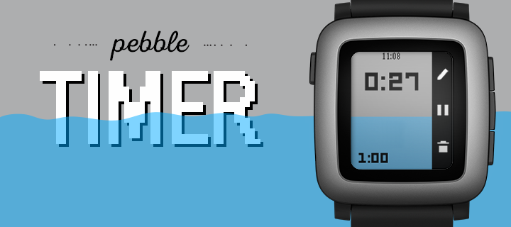
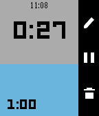

# pebble-timer

## About
Home of the original timer published by Pebble in the [Pebble App Store](https://apps.repebble.com/timer_55b6cd955e0716cd6b0000a1).

## Functionality

### Add and view timers

Timers appear in a list on the main screen. Add a timer via the "+" icon at the top of the list, similar to the alarm app. 

A detailed view of the timer can be accessed by either selecting one of the menu items on the main screen, or by choosing "Open timer" in the pin's action menu. In the detailed view, the timer can be played and paused as well as edited and deleted.

### Completion time

If when setting the timer the duration is greater than 15 minutes, the completion time of the timer will be displayed displayed under the entry fields. 

### Automatic timeline pins

The timer will send a pin to the timeline if the duration is greater than 15 minutes. 

### Wake API

If the app is closed out, it will automatically open and vibrate when a timer goes off. 

From this timer ended screen, the user can dismiss the timer or snooze the timer. The former will leave it as a paused timer in the menu window, and the latter will roll the timer back one minute.

## Changelog

### v1.2.1
- Added Gabbro platform support
- Improved UI scaling and font sizing across all screen sizes (Emery, Gabbro)
- Improved setting window UI scaling with dynamic layout calculations
- Fixed menu icon rendering artifact (black block/triangle) on round displays
- Cleaned play icon anti-aliasing for crisp rendering on all platforms

Thanks to [Thomas Buchheit](https://github.com/thomas5014) for contributing Emery/Gabbro support and UI scaling improvements.
